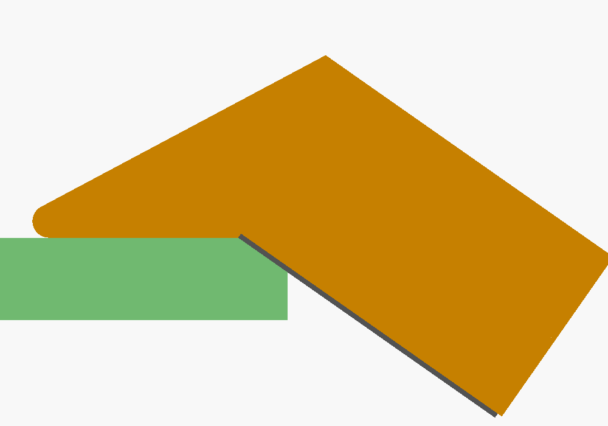
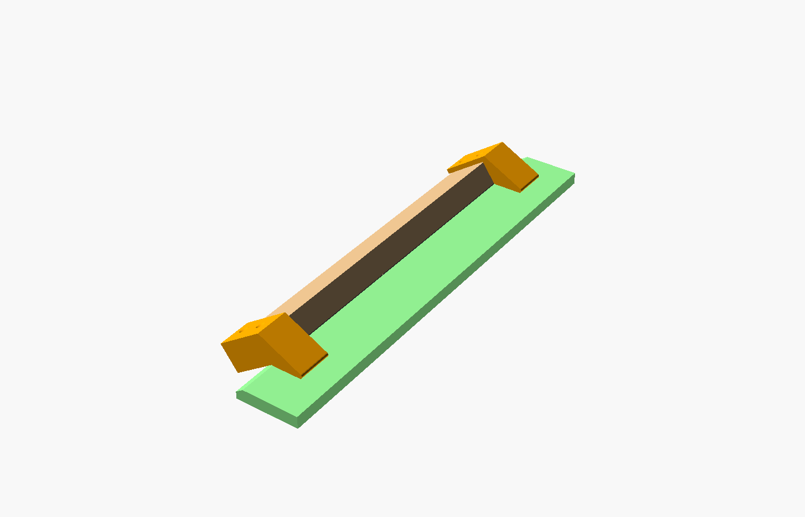

# 35° bevel sanding block brackets

Two printed end brackets turn a 1×2 furring strip (actual 1.5 × 0.75 in) into a
sanding block for the blade bevels. The foot rides flat on the foam's face and the
sandpaper meets it at a **145° open angle**, so the sanded surface ends up **35°** off
the face. Sand until the paper reaches the green bevel line.

 

| File | Use |
|---|---|
| `bevel-sander-left.stl`, `bevel-sander-right.stl` | Print **one of each** (mirror images) |
| `bevel-sander.scad` | Editable source; sizes are in the Customizer |
| `preview.scad` | Preview scene only (strip, sandpaper, 10 mm foam) |

## Print

End cap flat on the bed, no supports. PLA or PETG, 0.2 mm layers, 3–4 walls,
15–20% infill. Each bracket is about 71 × 44 × 28 mm.

## Assemble

1. Cut the strip to length (250–300 mm works well), with square ends.
2. Glue sandpaper to one **1.5 in face** for the full length. Use PSA paper or spray adhesive; the design allows 0.6 mm for paper plus glue.
3. Push a bracket onto each end until the strip's end hits the end cap. The wide flange goes on the back face, the narrow wall on the edge nearest the foot.
4. Drive two **#6 × 5/8 in** countersunk wood screws through each flange. Drill 2 mm pilot holes first; 3/4 in is the longest screw that won't come out through the sandpaper face.

## Use

- Lay the blade flat with the edge you are beveling **hanging over the table edge**: the sanding face reaches about 22 mm below the foam's top face.
- Keep the feet flat on the foam, on the flat part between the green lines, and stroke along the edge. Then flip the blade over and do the other face.
- The strip is straight. It works on straight and convex edges and on gentle curves, but not inside the round bite or the barbed opening. Finish those by hand.

Measure your strip before printing. If it isn't 38.1 × 19.05 mm, open the SCAD and
set `wood_width` / `wood_thickness`, then re-export. Change `bevel_angle` for other
angles.

```bash
openscad -o bevel-sander-left.stl  -D 'side="left"'  bevel-sander.scad
openscad -o bevel-sander-right.stl -D 'side="right"' bevel-sander.scad
```
