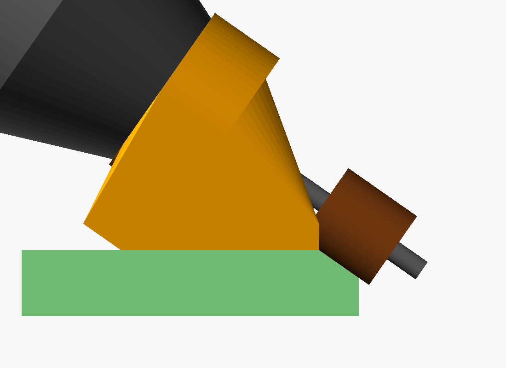
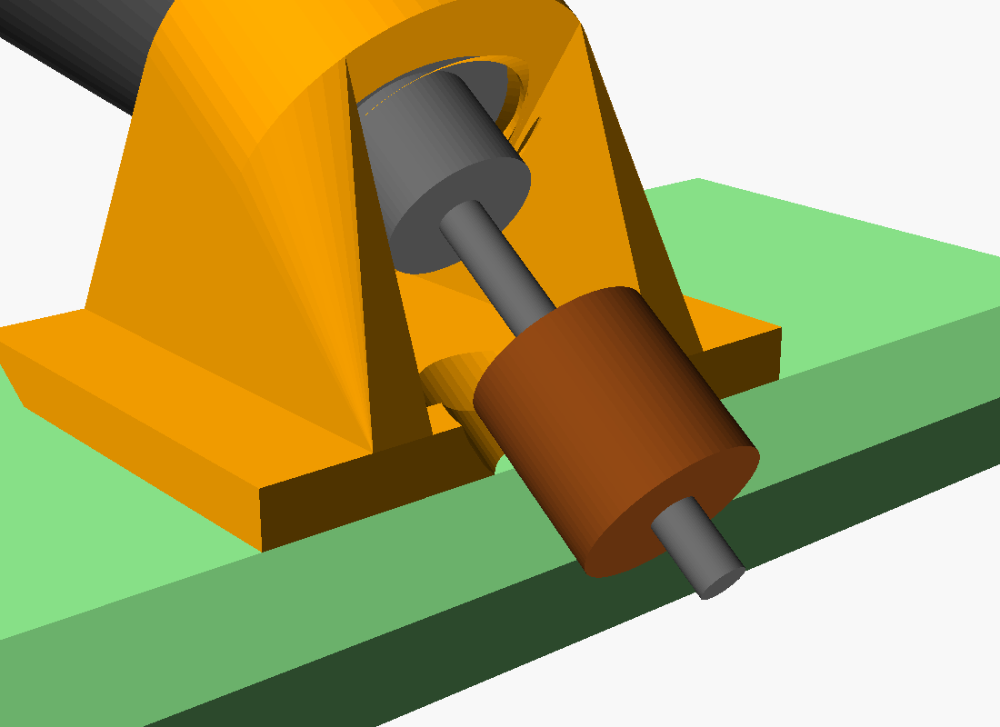

# Dremel 35° bevel jig

Screws onto a Dremel 3000/4000/4300/8220 in place of the nose cap. With a
**1/2 in sanding drum (Dremel 407)**, it sands the same **35°** blade bevel as the
[sanding block](../bevel-sander/README.md). The Dremel leans back over the foam
with its nose pointing down at the edge. The drum's axis lies in the bevel plane,
so the side of the drum sands a flat bevel. A forked foot straddles the drum and
rides flat on the foam face. Its front edge marks where the bevel starts, so you
sand until the front edge sits on the green line.

 

| File | Use |
|---|---|
| `thread-test.stl` | Print **first**: a 6 mm ring with the jig's nose thread |
| `dremel-bevel-jig.stl` | The jig, already in its print orientation |
| `dremel-bevel-jig.scad` | Editable source; sizes are in the Customizer |
| `preview.scad` | Preview scene only (stand-in Dremel, drum, 10 mm foam) |

## Print

1. Unscrew the Dremel's nose cap and try the **thread test** ring on the nose. It should spin on by hand without wobbling. If it's tight, raise `thread_clearance` (0.5 → 0.7). If it's sloppy, lower it. Re-export both files after any change.
   The 3/4 in-12 thread comes from a forum post, not from Dremel. If the ring won't start at all, measure the nose thread and set `thread_d` and `thread_pitch`.
2. Print the jig **collar-down**, as exported, with no supports. Use PLA or PETG, 3–4 walls and 20–30% infill. A brim helps, because it stands on the collar alone. The jig is about 44 × 38 × 34 mm.

**Thread quality (A1 mini).** Print the test ring and the jig with the **same settings**, or the fit you find won't carry over.
- **Layer height:** use 0.12 mm ("0.12mm Fine @BBL A1M"). That gives about 18 layers per turn of the 2.1 mm pitch, instead of about 10 at 0.20 mm. To save time, apply 0.12 mm only to the bottom 13 mm with a height range modifier.
- **Seam:** set it to Aligned or Back, so it's one line you can trim.
- **Outer wall speed:** about 100 mm/s.
- **Elephant foot compensation:** leave it on.
- **Hole compensation:** leave "X-Y hole compensation" at 0. Tune the fit with `thread_clearance` instead.

Both parts have a 0.8 mm 45° lead-in at the thread entry (`thread_chamfer`). After printing, run the jig on and off the nose a few times. A rub of candle wax helps.

## Set up

1. Put the drum on its mandrel, then fit the mandrel loosely in the collet.
2. Screw the jig on in place of the nose cap, hand-tight, until it seats on the shoulder.
3. Slide the mandrel until the **upper end of the drum is level with the foot plate**, anywhere within its 4 mm thickness, as seen through the fork. Then tighten the collet. Anywhere in that range sands a full bevel up to the green line.
   If the drum can't reach that far, or can't go back far enough, change `shoulder_to_drum` (default 30 mm, measured from the nose shoulder to the drum's top end) and reprint.

To change the drum, unscrew the jig.

## Use

- Lay the blade flat with the edge **hanging over the table edge**, as with the block. Keep the foot on the flat part, between the green lines.
- Use low to medium speed (about 5,000–10,000 RPM) and light passes. High speed melts and glazes EVA.
- The spinning drum pulls the jig along the edge in one direction. **Feed the other way**, so the drum works against you instead of running off.
- Sand until the front edge of the foot rides on the green line along its whole length. Flip the blade over and repeat on the other face.
- Unlike the straight block, the drum only touches the edge across a 12.7 mm line, so it can follow curves, including concave ones. Only the middle of the foot, just behind the drum, needs foam under it. Try the round bite and the barbed opening on scrap first. If the drum or mandrel screw hits the far side of the opening, finish that spot by hand.

To regenerate (CGAL takes about 2 minutes on the thread):

```bash
openscad -o thread-test.stl -D 'part="thread-test"' dremel-bevel-jig.scad
openscad -o dremel-bevel-jig.stl dremel-bevel-jig.scad
```
